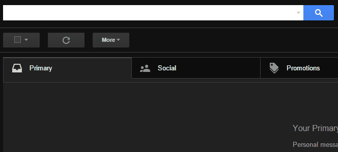

Like to keep an organised email inbox? I definitely do, here are a few tips I picked up over the last few years, and how I combine them all to help me maintain an organised, and often empty, inbox.

## Address Alias

Address aliases allow you to specify an alias after the `+` symbol, so for example emails sent to `damianmullins+myalias123@gmail.com` will be delivered to the inbox for `damianmullins@gmail.com`.

You can see the alias you applied when an email is delivered which is great for being able to tell if a website has shared your information, and also very useful when combined with filters (more on that shortly).

Another little known tip with Gmail is that you can add dots anywhere in your email address and it will still be delivered to your inbox, so for example `dam.ian.mul.lin.s@gmail.com` will be delivered to the inbox for `damianmullins@gmail.com`.

I've testing alias with outlook.com (hotmail, live etc) and they appear to work there, this is not a feature unique to gmail!

## Filters

Filters allow you to find email based on certain conditions and then perform automated actions against those emails as they are received.

I use filters to match email sent to addresses which have an alias, for me this is mostly email from social networks or newsletters.

### Search by email

You can match these emails using the full address by clicking the arrow in the search box and typing the email address into the `From` field. You can also use wildcard selectors (`*`) in the search box.

I used to create filters this way, but unless you're using wildcards they can become brittle when the senders of the emails you receive changes the address they send with. Once I discovered aliases there was no looking back.

### Search by alias

There are a few ways you can match by alias, the first of which is typing the entire email address into the `To` field

Using the `deliveredto` operator in the `Includes the words` field

Shorten the previous filter to just the alias in the `Includes the words` field

This last example is the one I favour; less to type and remember.

### Creating a filter

The next step is to create a filter from this search, this is done by clicking the ___Create filter with this search___ link at the bottom of the search panel.

I like to select ___Never send it to Spam___ and ___Never mark it as important___ as shown in the animation above so that I can guarantee that none of these emails are sent to the spam folder and also that there aren't mixed in with other email marked as important.

## Labels

Finally, I make heavy use of labels which when combined with filters can help ensure your email is organised and easily searchable.

Using the same technique as above to create to filters (or editing an existing filter from settings) you can select a label from the ___Apply the label___ dropdown.

Now any incoming email matching a filter will automatically be sorted according to your settings and have a label applied, making the task of keeping an organised inbox a lot easier.

### Searching for labels

To search for labels use the search box at the top of the page, type in `label:` and then the name of the label you are after, the list autocompletes making searching a breeze.

Gmail provides lots of keyboard shortcuts (which I'm a huge fan of), so to search for a label you can save time by typing `g` then `l` (for go label), this will focus on the search bar and prefill the `label:` search prefix, you then type the name of the label you're looking for and et voila all emails with that label are displayed.

## Summary

Whilst writing this post I've realised just how much I rely on the techniques above to help me maintain an organised inbox, I'm sure there are many more techniques I'm not aware of which people use day to day, I'd love to hear about them in the comments below.
