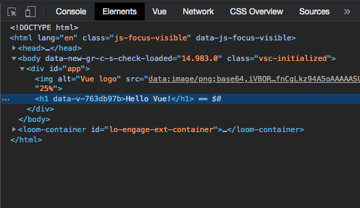
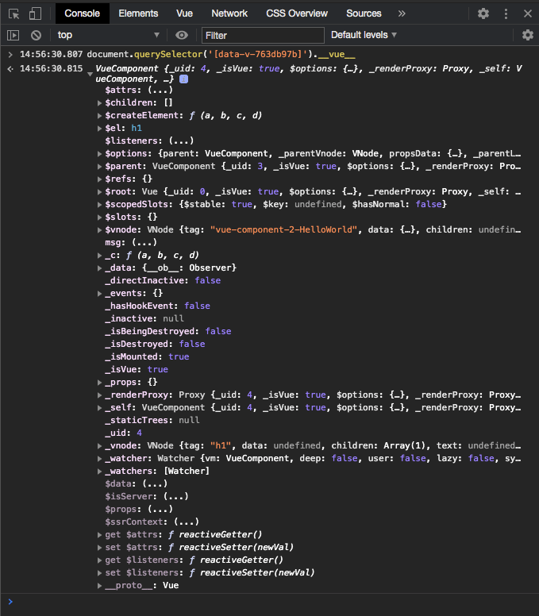

The Vue.js devtools are great to use when in the process of developing a web application. However, once you deploy to production it no longer has access to the code it needs in order to work. So how can we inspect an application once released to production? In this post, we’ll walk through the options available to you along with some tricks and tips to make the process a little easier.

## Triggering a Prop Value Update

As well as figuring out how to inspect the Vue internal variables let’s also attempt to update a component prop value.

Say we have a component which has a prop controlling the text of an element, how can we force the value to change in order to trigger a UI update?

```javascript
<template>
  <h1>{{ msg }}</h1>
</template>

<script>
export default {
  props: {
    msg: {
      type: String,
      default: ''
    }
  }
};
</script>
```

## Finding The Vue Component Instance

To start we need to locate the top-level element of the component using the Chrome devtools elements panel. In this case, the element is the `h1`.




### Using the $0 Command

Once you have the element selected you can then move to the console panel in devtools and type `$0`.

`$0` will be a reference to the most recently selected element in the element panel.

> If you highlight another element you can still reference the last one by typing $1, this will work for the last 5 elements highlighted.

To see the Vue instance details you can type `$0.__vue__`.


### Using the document.querySelector Method

You can also select the element using any of the DOM lookup methods such as `querySelector` or `getElementById` etc. In this case, we’ll use `document.querySelector` to see the Vue instance:

```javascript
document.querySelector('[data-v-763db97b]').__vue__
```

Here we’re using looking up the element via its data attribute, but you can use any valid CSS selector within `querySelector`.


## Locating the Prop Value

Now that we have a reference to the Vue component instance we can expand it in the console to see what’s inside:



Welcome to the guts of Vue.js! Here you can see all of the object properties Vue has attached to the component. If you're using any plugins such as Vuex or vue-i18n you’ll see a reference to them here as well.

Let’s continue on with our task of updating the prop value. Look carefully and you’ll see our `msg` prop right in the middle, click on the three dots and you’ll see the current value of the prop.

You can view the prop value on its own using your preferred command in the console:

```javascript
// Using $0
$0.__vue__.msg

// Using querySelector
document.querySelector('[data-v-763db97b]').__vue__.msg
```

## Updating the Prop Value

Updating the prop value is now a case of updating the variable assignment to your desired value. So, for example, using the `$0` technique above you’d type this into the console:

```javascript
$0.__vue__.msg = 'Hello from the update value!'
```

Lo and behold you’ll see the UI update before your very eyes!

## Conclusion

In this post, we’ve used the Chrome devtools console to locate elements and inspect the related Vue component instance details, as well as manipulating the Vue instance object to update a prop value.

One thing to note is that you aren’t limited to just string values, you can update any other type of prop such as booleans and numbers.

There are limitations with the types of things you can update using this technique such as not being able to update computed properties as they have no setter. Still, being able to inspect the values assigned to components in production can be extremely useful.

In a future post, I’ll use the technique described in this post to set up logging of Vuex actions and mutation information to the devtools console.
